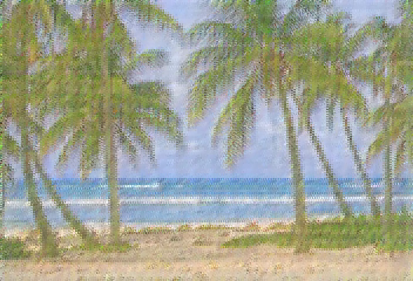
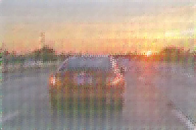
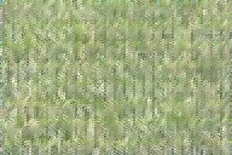

# LTX-2-MLX

Native Apple Silicon implementation of [Lightricks LTX-2](https://github.com/Lightricks/LTX-2), a 19B parameter joint audio-video generation model, using MLX.

## Example Outputs

Generated videos from text prompts (frames shown):

| "A beautiful tropical beach with palm trees and blue ocean waves" | "A red sports car driving on a highway at sunset" | "A blue ball bouncing on green grass" |
|:---:|:---:|:---:|
|  |  |  |

*Generated at 480x704 (beach) and 256x384 (others) with 8 denoising steps using the distilled model.*

## Features

- **Native MLX Implementation**: Full transformer (19B), VAE decoder, audio VAE, vocoder, and text encoder ported to MLX
- **Apple Silicon Optimized**: Designed for M-series Macs (tested on M3 Max 128GB)
- **FP16 Inference**: `--fp16` flag reduces memory usage by ~50%
- **Audio-Video Generation**: Support for synchronized audio with video (experimental)
- **Spatial/Temporal Upscaling**: 2x resolution and 2x framerate upscalers
- **CFG Support**: Classifier-Free Guidance with configurable scale
- **Memory Optimization**: Intermediate tensor cleanup during inference

## Project Structure

```
LTX_2_MLX/
├── model/
│   ├── transformer/     # 48-layer DiT with 3D RoPE (14B video + 5B audio)
│   ├── video_vae/       # VAE encoder/decoder with 3D convolutions
│   ├── audio_vae/       # Audio VAE decoder + HiFi-GAN vocoder
│   ├── text_encoder/    # Gemma 3 12B feature extractor + connector
│   └── upscaler/        # Spatial (2x res) and temporal (2x fps) upscalers
├── components/          # Schedulers, patchifiers, guiders
├── loader/              # Weight conversion utilities
└── types.py             # Type definitions
scripts/
├── generate.py          # Main generation script
├── download_gemma.py    # Gemma weights download
├── encode_text_mlx.py   # Standalone text encoding
└── validate_*.py        # Validation scripts
```

## Requirements

- Python 3.10+
- macOS with Apple Silicon (M1/M2/M3/M4)
- ~25GB RAM for FP16 inference, ~45GB for FP32 (128GB recommended)

### Dependencies

#### Using `uv` (Recommended)

The fastest way to get started - `uv` automatically manages dependencies:

```bash
# Install uv if you haven't already
curl -LsSf https://astral.sh/uv/install.sh | sh

# Run tests (uv handles all dependencies automatically)
uv run pytest tests/ -m unit -v

# Run video generation
uv run python scripts/generate.py --prompt "Your prompt here"
```

#### Using `pip`

```bash
pip install mlx safetensors numpy pillow tqdm transformers
```

For video/audio encoding:
```bash
brew install ffmpeg
```

## Weights

Download the LTX-2 weights from HuggingFace:

```bash
mkdir -p weights/ltx-2
# Download one of:
# - ltx-2-19b-distilled.safetensors (43GB, BF16, 3-7 steps)
# - ltx-2-19b-distilled-fp8.safetensors (27GB, FP8, 3-7 steps)
# - ltx-2-19b-dev.safetensors (43GB, BF16, 25-50 steps)
```

Optional upscaler weights:
```bash
# - ltx-2-spatial-upscaler-x2-1.0.safetensors (995MB)
# - ltx-2-temporal-upscaler-x2-1.0.safetensors (262MB)
```

## Usage

### Basic Generation

```bash
python scripts/generate.py "A cat walking through a garden" \
    --height 256 --width 256 \
    --frames 17 --steps 5 \
    --output output.mp4
```

### With FP16 (Recommended for lower memory)

```bash
python scripts/generate.py "A cat walking through a garden" \
    --height 480 --width 704 \
    --frames 25 --steps 7 \
    --fp16 --output output.mp4
```

### With Upscaling

```bash
# Generate at 256x256, upscale to 512x512
python scripts/generate.py "A cat walking through a garden" \
    --height 256 --width 256 \
    --frames 17 --steps 5 \
    --upscale-spatial --output output.mp4
```

## Pipelines

LTX-2 MLX provides **6 specialized pipelines** for different use cases. Use the `--pipeline` flag to select:

### Available Pipelines (via `--pipeline` flag)

#### 1. `text-to-video` (Default)
Standard text-to-video generation with simple CFG denoising.

```bash
python scripts/generate.py "A cat walking" \
    --pipeline text-to-video \
    --height 480 --width 704 --frames 25 --steps 7
```

**Best for**: Basic video generation, quick testing

#### 2. `distilled` ⚡ Fast
Two-stage distilled model optimized for speed (no CFG, 10 total steps).

```bash
python scripts/generate.py "A cat walking" \
    --pipeline distilled \
    --height 480 --width 704 --frames 25
```

- **Stage 1**: 7 steps at half resolution
- **Stage 2**: 3 steps refinement
- **Speed**: ~2x faster than standard
- **Quality**: Good for most use cases
- **Best for**: Fast iteration, batch generation

#### 3. `one-stage` 🎨 Quality
Single-stage CFG with full control and adaptive sigma scheduling.

```bash
python scripts/generate.py "A cat walking" \
    --pipeline one-stage \
    --cfg 5.0 --steps 20 \
    --height 480 --width 704 --frames 25
```

- Uses LTX2Scheduler for token-count-dependent sigma schedule
- Optional image conditioning via latent replacement
- Full CFG control with positive/negative prompts
- **Best for**: High-quality single-resolution generation

#### 4. `two-stage` ✨ HQ + Upscaling (Recommended for High-Res)
Two-stage pipeline with spatial upscaling for high-resolution output.

```bash
python scripts/generate.py "A cat walking" \
    --pipeline two-stage \
    --height 512 --width 704 \
    --cfg 5.0 --steps-stage1 15 \
    --spatial-upscaler-weights weights/ltx-2/ltx-2-spatial-upscaler-x2-1.0.safetensors \
    --distilled-lora weights/ltx-2/ltx-2-19b-distilled-lora-384.safetensors \
    --fp16
```
> **Note**: Resolution is automatically adjusted to be divisible by 64 (required for the two-stage pipeline).
```

- **Stage 1**: Generate at half resolution (256x352) with CFG
- **Stage 2**: 2x spatial upscale + 3 distilled refinement steps
- **Final output**: 512x704 (or higher)
- Combines CFG quality with distilled speed
- **Best for**: High-resolution video generation (512x704+)

**Quality**: Matches one-stage baseline with 2x resolution increase

### Additional Pipelines (Code-Only)

#### 5. Image Conditioning LoRA (`ic_lora`)
Video-to-video generation with control signals (depth, pose, edges).

```python
from LTX_2_MLX.pipelines import ICLoraPipeline, create_ic_lora_pipeline

pipeline = create_ic_lora_pipeline(
    transformer=model,
    video_decoder=decoder,
    # ... requires IC-LoRA weights
)
```

- Two-stage with IC-LoRA in Stage 1 only
- Control signals: depth maps, human pose, edge detection
- **Best for**: Controlled video-to-video generation

#### 6. Keyframe Interpolation (`keyframe_interpolation`)
Generate videos by interpolating between keyframe images.

```python
from LTX_2_MLX.pipelines import KeyframeInterpolationPipeline, Keyframe

keyframes = [
    Keyframe(image=img1, frame_index=0),
    Keyframe(image=img2, frame_index=24),
]

video = pipeline(keyframes=keyframes, ...)
```

- Two-stage with keyframe conditioning
- Smooth interpolation between images
- **Best for**: Image sequence animation

### Pipeline Comparison

| Pipeline | Speed | Quality | Resolution | CFG | Best Use Case |
|----------|-------|---------|------------|-----|---------------|
| `text-to-video` | Medium | Good | Any | ✓ | Basic generation |
| `distilled` | **Fast** (10 steps) | Good | Up to 480p | ✗ | Quick iteration |
| `one-stage` | Slow (20+ steps) | **High** | Any | ✓ | Quality priority |
| `two-stage` | Medium (18 steps) | **High** | **512p+** | ✓ | High-resolution |
| `ic_lora` | Medium | High | 512p+ | ✓ | Controlled gen |
| `keyframe_interpolation` | Medium | High | 512p+ | ✓ | Image animation |

### Recommended Settings by Use Case

**Fast Previews (< 1 min)**
```bash
--pipeline distilled --height 256 --width 384 --frames 17
```

**Balanced Quality/Speed (1-2 min)**
```bash
--pipeline one-stage --height 480 --width 704 --frames 25 --steps 15 --cfg 4.0 --fp16
```

**Maximum Quality (2-3 min)**
```bash
--pipeline two-stage --height 512 --width 704 --frames 33 --steps-stage1 20 --cfg 6.0 --fp16
```

**High Resolution (3-4 min)**
```bash

--pipeline two-stage --height 768 --width 1024 --frames 25 --steps-stage1 15 --distilled-lora weights/ltx-2/ltx-2-19b-distilled-lora-384.safetensors --fp16
```

### Options

| Flag | Description | Default |
|------|-------------|---------|
| `--pipeline` | Pipeline: `text-to-video`, `distilled`, `one-stage`, `two-stage` | text-to-video |
| `--height` | Video height (divisible by 32) | 480 |
| `--width` | Video width (divisible by 32) | 704 |
| `--frames` | Number of frames (N*8+1) | 97 |
| `--steps` | Denoising steps | 7 |
| `--steps-stage1` | Stage 1 steps (two-stage pipeline) | 15 |
| `--steps-stage2` | Stage 2 steps (two-stage pipeline) | 3 |
| `--cfg` | Classifier-free guidance scale | 3.0 |
| `--seed` | Random seed | 42 |
| `--output` | Output video path | gens/output.mp4 |
| `--weights` | Path to weights file | weights/ltx-2/ltx-2-19b-distilled.safetensors |
| `--fp16` | Use FP16 computation (~50% memory reduction) | False |
| `--fp8` | Load FP8-quantized weights | False |
| `--model-variant` | `distilled` (fast) or `dev` (quality) | distilled |
| `--spatial-upscaler-weights` | Path to spatial upscaler weights (for two-stage) | None |
| `--temporal-upscaler-weights` | Path to temporal upscaler weights | None |
| `--upscale-spatial` | Apply 2x spatial upscaling (legacy) | False |
| `--upscale-temporal` | Apply 2x temporal upscaling (legacy) | False |
| `--generate-audio` | Generate synchronized audio (experimental) | False |
| `--low-memory` | Aggressive memory optimization (~30% less) | False |
| `--skip-vae` | Skip VAE decoding (output latent visualization) | False |
| `--no-gemma` | Use dummy embeddings (testing only) | False |
| `--embedding` | Path to pre-computed text embedding (.npz) | None |
| `--gemma-path` | Path to Gemma 3 weights | weights/gemma-3-12b |

### Frame Count

LTX-2 requires frames to satisfy `frames % 8 == 1`:
- Valid: 9, 17, 25, 33, 41, 49, 57, 65, 73, 81, 89, 97, 121
- Formula: latent_frames = 1 + (frames - 1) / 8

## Architecture

LTX-2 is a **joint audio-video diffusion transformer** with asymmetric dual streams:

```
Text Prompt → Gemma 3 (12B) → [Video Context, Audio Context]
                                      ↓
              48-Layer Asymmetric Dual-Stream Transformer
              ┌─────────────────────────────────────────┐
              │  Video Stream (14B) ←→ Audio Stream (5B) │
              │  Cross-attention for synchronization     │
              └─────────────────────────────────────────┘
                                      ↓
              Video VAE Decoder → Pixels (up to 768×512, 25fps)
              Audio VAE Decoder → Mel → Vocoder → 24kHz audio
```

### Transformer (19B parameters)

- 48 transformer layers
- **Video stream** (14B): 32 heads × 128 dim = 4096 hidden, 3D RoPE (x, y, t)
- **Audio stream** (5B): 16 heads × 128 dim = 2048 hidden, 1D RoPE (temporal)
- Bidirectional audio-video cross-attention for synchronization
- Cross-attention to text embeddings

### Video VAE Decoder

- 128 latent channels → 3 RGB channels
- 1:192 compression ratio (32x spatial × 8x temporal)
- **Timestep conditioning**: performs final denoising step during decode
- Pixel norm with scale/shift conditioning

### Audio VAE Decoder + Vocoder

- 8 latent channels → mel spectrogram
- HiFi-GAN vocoder: mel → 24kHz stereo audio waveform

### Text Encoder

- **Gemma 3 12B** feature extraction (48 layers × 3840 dim)
- Multi-layer aggregation from all decoder layers
- Separate video/audio context projections
- Caption projection (3840 → 4096 for video, 3840 → 2048 for audio)

## Text Encoding Options

### Option 1: Automatic (Recommended)

The generation script automatically loads Gemma 3 if available:

```bash
python scripts/generate.py "A cat walking through a garden" \
    --gemma-path weights/gemma-3-12b \
    --height 256 --width 256 --frames 17
```

### Option 2: Pre-computed Embeddings

Encode once, generate multiple times:

```bash
# Encode prompt
python scripts/encode_text_mlx.py "A cat walking through a garden" \
    --gemma-path weights/gemma-3-12b \
    --ltx-weights weights/ltx-2/ltx-2-19b-distilled.safetensors \
    --output prompt_embedding.npz

# Generate with pre-computed embedding
python scripts/generate.py --embedding prompt_embedding.npz \
    --height 480 --width 704 --frames 25 --steps 5
```

### Option 3: Dummy Embeddings (Testing)

For testing pipeline without Gemma:

```bash
python scripts/generate.py "A cat walking" --no-gemma --height 128 --width 128
```

### Downloading Gemma 3 12B

LTX-2 requires **Gemma 3 12B** (~25GB, loaded as FP16 = ~12GB in memory):

```bash
# Using the download script (requires HuggingFace token):
pip install huggingface_hub
python scripts/download_gemma.py --token YOUR_HF_TOKEN

# Or set environment variable:
export HF_TOKEN=your_token
python scripts/download_gemma.py
```

Get your token at: https://huggingface.co/settings/tokens

Accept the Gemma license at: https://huggingface.co/google/gemma-3-12b-it

## Current Status

### Working ✅
- **Text-to-video generation producing semantic content** (palm trees, sunsets, grass, etc.)
- **6 specialized pipelines**: text-to-video, distilled, one-stage, two-stage, ic-lora, keyframe-interpolation
- **Two-stage pipeline with spatial upscaling** (512x704+, verified high quality with Distilled LoRA)
- **Distilled LoRA Support** (for refining details in Stage 2)
- Full text encoding pipeline (all 49 Gemma layers + normalization + projection)
- Native MLX Gemma 3 12B text encoder (FP16)
- 48-layer transformer (19B parameters) verified to match PyTorch exactly (correlation = 1.0)
- Video VAE decoder with timestep conditioning
- Audio VAE decoder (converts latents to mel spectrograms)
- HiFi-GAN vocoder (converts mel to 24kHz audio)
- CFG (Classifier-Free Guidance) with configurable scale
- Memory optimization with intermediate tensor cleanup
- Video export via ffmpeg
- Tested at resolutions up to 768x1024

### In Progress 🚧
- FP8 weight loading (27GB quantized models)
- Temporal upscaler (2x framerate)
- Full audio-video joint generation with two-stage pipeline

### Pending 📋
- Image-to-video conditioning via IC-LoRA (code exists, needs CLI integration)
- Keyframe interpolation (code exists, needs testing)
- Generic LoRA support (infrastructure exists, standard LoRAs in testing)

## Known Limitations

### Memory Requirements
- **Text-to-Video (480×704, 97 frames)**: ~28GB RAM (FP32), ~18GB (FP16)
- **Two-Stage Pipeline (960×1408, 97 frames)**: ~44GB RAM (FP32, sequential), ~59GB (parallel)
- **With Audio Generation**: Add ~6GB for audio VAE + vocoder
- **Recommendation**: Use `--low-memory` flag on systems with <32GB RAM

### Text Embedding Quality
- Gemma 3's self-attention homogenizes embeddings across different prompts
- **Workaround**: `--early-layers-only` flag uses only initial embeddings (experimental)
- Trade-off: Better prompt differentiation vs alignment with model training
- See [TROUBLESHOOTING.md](docs/TROUBLESHOOTING.md) for details

### Audio Generation
- Audio generation works with single-stage pipeline only
- Two-stage pipeline does not yet support `--generate-audio` flag
- Audio quality is experimental

### Spatial Upscaling
- Res-block based upscaler has been stabilized (output normalization added)
- Previous bilinear workaround no longer required (as of 2026-01-11)
- Spatial upscaler weights still recommended for best quality

## Documentation

See the `docs/` folder for detailed documentation:

- [LTX-2 Architecture](docs/LTX-2-ARCHITECTURE.md) - Deep dive into model architecture
- [Troubleshooting](docs/TROUBLESHOOTING.md) - Common issues and solutions
- [Porting Guide](docs/PORTING.md) - Implementation status and details
- [PyTorch/MLX Differences](docs/PYTORCH_MLX_DIFFERENCES.md) - Framework comparison

## License

This project is for research and educational purposes. See the original [LTX-2](https://github.com/Lightricks/LTX-2) repository for model licensing.

## Acknowledgments

- [Lightricks](https://www.lightricks.com/) for LTX-2
- [Apple MLX Team](https://github.com/ml-explore/mlx) for the MLX framework
- [Google](https://ai.google.dev/gemma) for Gemma 3
